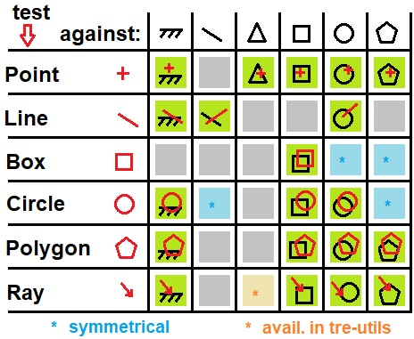
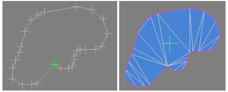

# TinyRenderEngine

TinyRnederEngine provides various utilities for the development of games or game engines,
such as mesh operations, contact algorithm, GUI.
It empowers game programmers to create prototypes.
It favors simplicity to embed and to use. 

It is written in C++11, with the usage of the STL.
Usage of third-parties is kept limited.
The main target platform is desktop that supports OpenGL 3.3 (primilary Windows and Linux).
The web-assembly platform is also supported, with the help of [Emscriten](https://emscripten.org/) and the compatibility with OpenGL ES 3. 

## Usage

No specific build process is required. 
You can either build a static/dynamic library from it (a CMake project is included, that handles being included inside another project),
or directly add the sources files into your existing project.

Some examples are provided in the [tests](./tests) directory.

## Features

### Contact algorithms (2D and 3D)

The contact algorithms perform intersection test between two ojbects.
It can additionally return the barycenter of the interpenetration, with the minimal translation needed to make the objects not penetrating with each others.

Here the map of supported 2D contacts:



### Mesh operations

Besides a light wrapper to OpenGL that holds GPU-buffers handlers and that encapsulates draw-call commands,
some mesh-processing algorithms are implemented.
These algorithms are not designed to be run in a real-time context, but for pre-processing purpose.

* compute of the bounding-box

* compute of the barycentric center, the aera (in 2D) and the volume (3D)

* compute of the convexe hull (**WIP**)

* simplification by reducing the number of vertices (**WIP**)

* triangulation (in 2D)
  


### Textures utilities

Handeling of textures can be tricky when dealing with formats and compression across OpenGL versions.
It basically wraps the 'glTexture2D' calls.

Compression algorithms have been implemented, even if the OpenGL drivers can acheive it on desktop platforms.
The proposed implementation is simple and it has limited features compared to standard implementations,
like [ETCPACK](https://github.com/Ericsson/ETCPACK)

Re-sampling methods are also available, that can transform the UV space.
A good example is to generate the cube-map faces from a single map in the equirectangular-spherical projection.


### Basic materials

A basic material library is proposed, that allows quick prototyping.
The generated shaders can be overwritten for more complexe rendering.

It implements:
* Diffuse color options: uniform-color, vertex-color, textured
* Lighting options: unidirectional light, point lights, shadow casting from the unidirectional light and the point lights
* Lighting models: Phong, BRDF
* Other features: texture altas and blending, soft-distance fadeout, instanced orientation and color  

Example: instanced billboards, textured and lighted:
```cpp
shaderInstancedBB.loadShader(
  tre::shader::PRGM_2Dto3D,
  tre::shader::PRGM_TEXTURED | tre::shader::PRGM_LIGHT_SUN | tre::shader::PRGM_SHADOW_SUN |
  tre::shader::PRGM_UNIPHONG | tre::shader::PRGM_INSTANCED | tre::shader::PRGM_INSTCOLOR  );
```

### Graphical user interface

A G.U.I toolkit is provided, that comes with a text-rendering helper and a font management.
It supports to bind callbacks and animations.
Note that [ImGUI](https://github.com/ocornut/imgui) is a powerful alternative to the present implementation.


### Profiler

A basic profiler is provided.
The code should be intrumentalized with `TRE_PROFILEDSCOPE("name", scoped-unique-cpp-name);`.
For now, it only supports one single thread.


### Audio

A wrapper to the SDL2 audio API is implemented.
This is an optional alternative to SDL_Mixer.

It also supports to read WAV and OPUS files, and is able to bake audio data.


## Dependencies

* OpenGL

* SDL2

* [glm](https://glm.g-truc.net/0.9.9/index.html)

* freetype (optional)

* SDL_Image (optional)

* [libTIFF](http://www.libtiff.org) (optional)

* [opus](https://opus-codec.org) (optional)
